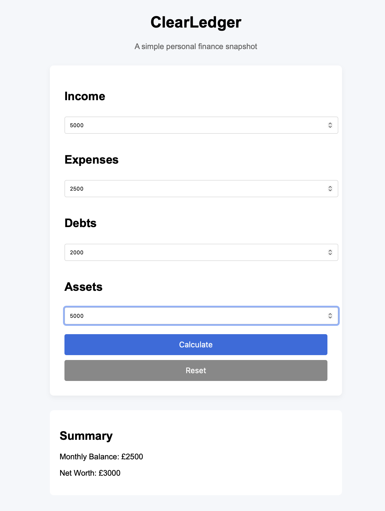

# ClearLedger

## Screenshot

ClearLedger is a simple privacy-first personal finance snapshot tool.

It allows users to quickly see their financial position by entering four numbers:

- Income
- Expenses
- Debts
- Assets

The tool instantly calculates:

- Monthly balance
- Net worth

All data is stored locally in the user's browser using localStorage. No information is sent to any server.

---

## Features

- Simple financial snapshot
- Automatic calculations
- Local data storage
- Reset functionality
- Clean minimal interface

---

## How It Works

The application performs two basic calculations.

Monthly balance:

Income – Expenses

Net worth:

Assets – Debts

Results update automatically as values are entered.

---

## Privacy

ClearLedger is designed to be privacy-first.

- No accounts
- No tracking
- No server communication
- Data stored locally in the browser

---

## Running the Tool

1. Download the repository
2. Open `index.html` in a browser

No installation or server setup is required.

---

## Project Structure
clearledger
index.html
style.css
app.js
README.md

---

## Purpose

This project was created as a lightweight personal finance tool and as a documentation example for a technical writing portfolio.

---

## Documentation

Full documentation is available in the `/docs` directory.

- [Documentation Index](docs/index.md)
- [User Guide](docs/user-guide.md)
- [Architecture](docs/architecture.md)
- [Calculations](docs/calculations.md)
- [Privacy](docs/privacy.md)